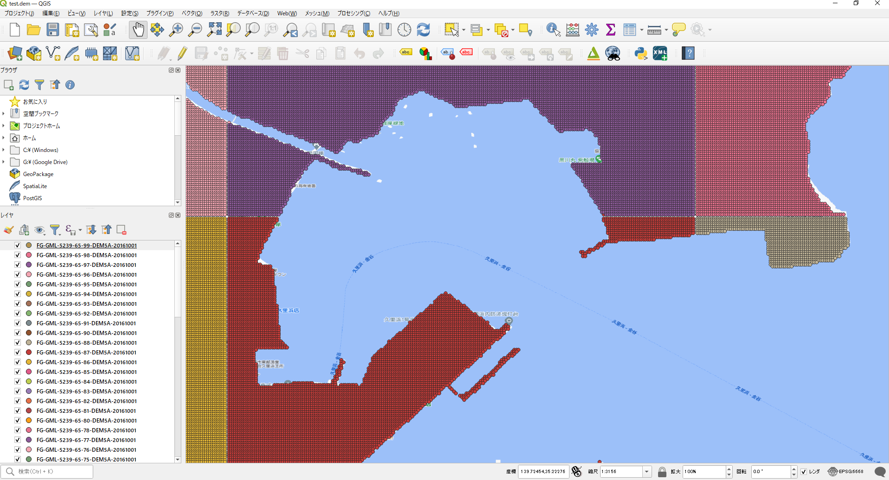

# 国土地理院 基盤地図情報 ダウンロードデータユーティリティ

国土地理院 基盤地図情報ダウンロードサイトよりダウンロード可能なファイルを
QGISなどへインポート可能な GeoJSON/Shape ファイルに変換するユーティリティリポジトリ。

基盤地図情報ダウンロードサイトからは大きく３つの種類のデータがダウンロード可能である。

| 項目名(ツールREADMEへのリンク) | 概要 |
|:--|:--|
| [基本情報](./basic) | 建物、道路、公共交通、河川など地図上のオブジェクトをあらわすベクタデータ。地図を表示させるときに使用される。 | 
| [数値標高モデル](./dem) | 5m/10mメッシュごとの座標の標高（メートル）が格納されたベクタデータ。等高線を生成する、現在位置の推定標高値算出に使用される。 |
| [ジオイドモデル](./geoid/) | 5m/10mメッシュごとの座標の楕円回転体からの標高差（メートル）が格納されたベクタデータ。GPSで得られたデータなど楕円回転体基準で計測された標高値をジオイド面を基準とした標高値に変換するときに使用される。 |

> 基盤地図情報を扱うための基礎知識については以下の資料を参考のこと。
> 
> - [【PDF】国土地理院基盤地図情報～GIS データの基本～](./docs/geospatial_information_public.pdf)

## 注意

- 測地座標系は JGD2011v2.1 (EPSG:6668) 準拠のGeoJSON/Shapeファイルを生成

## 出典

- [国土地理院 基盤地図情報サイト](https://www.gsi.go.jp/kiban/)

本資料では、国土地理院基盤地図情報ダウンロードデータをもとに加工したものを表示しています。

## ライセンス

[MITライセンス](./LICENSE) 準拠とします。